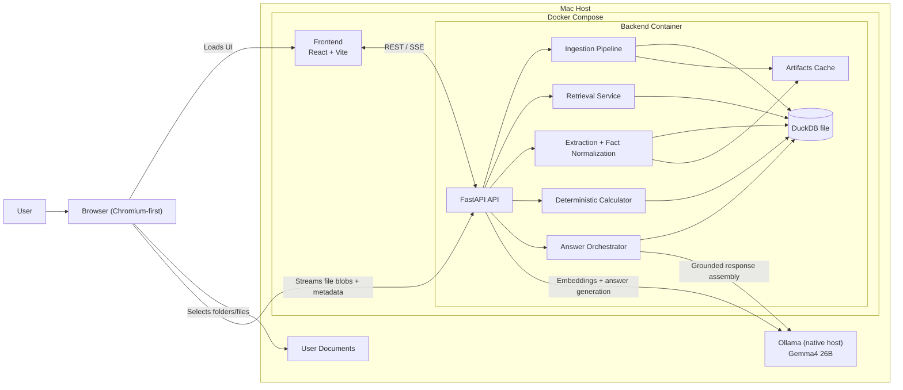
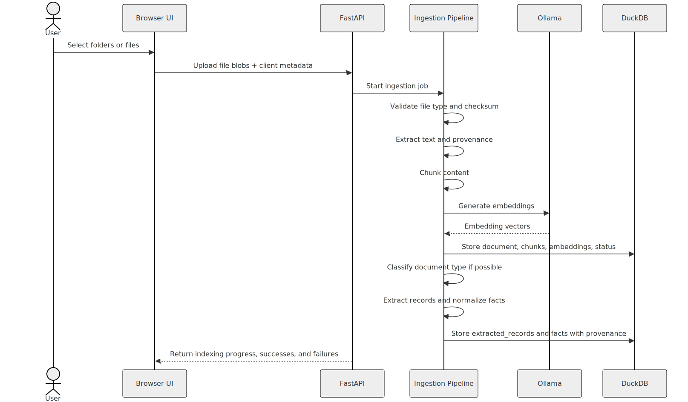
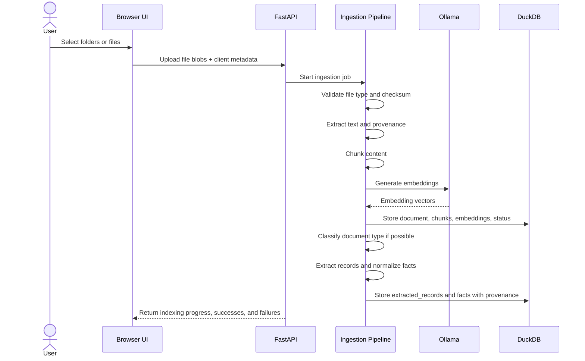
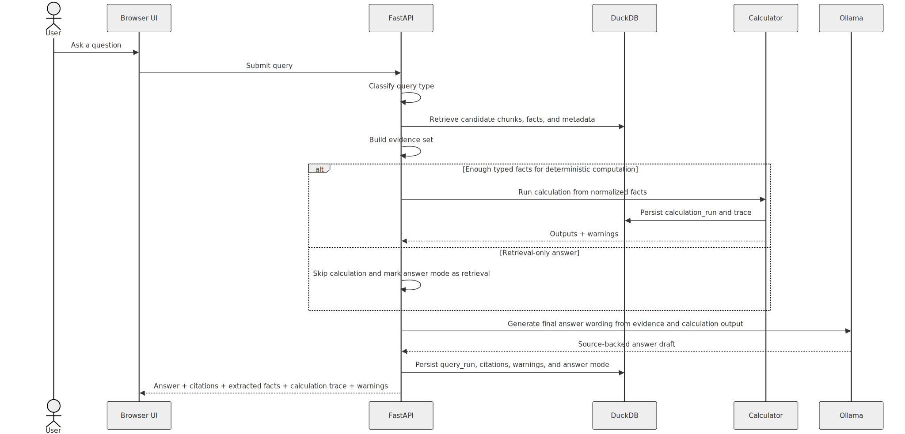
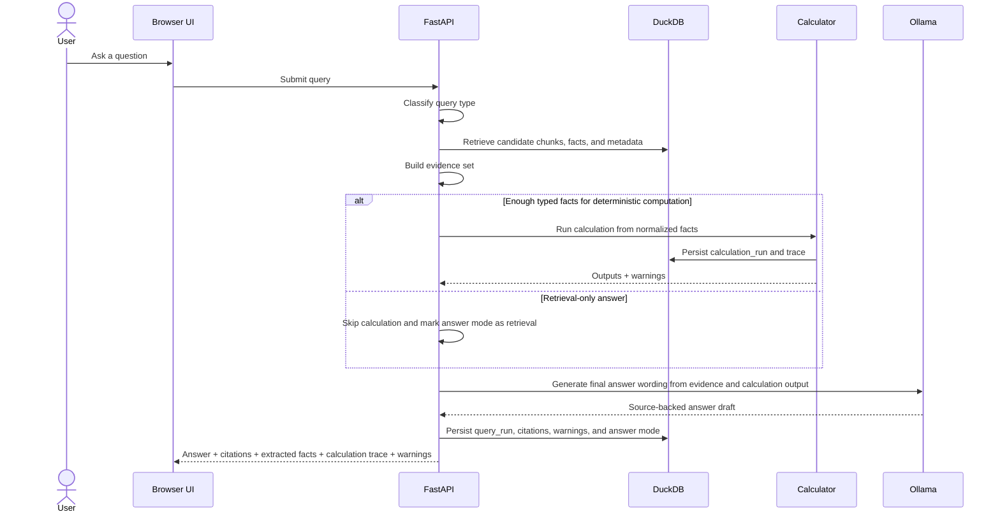

# Personal Records Intelligence Architecture

See also: [Low-Level Architecture](./low-level-architecture.md)
See also: [DuckDB Setup](./duckdb-setup.md)
See also: [Docker Setup](./docker-setup.md)

If your Markdown viewer does not render Mermaid, the SVG fallback images below should still display.

## MVP Decisions

- Product form: local web application
- Deployment model: Docker for frontend and backend
- User model: single-user, single-machine, no sync
- Database: DuckDB embedded in the backend container on a mounted volume
- Model runtime: Ollama running natively on the Mac host
- Fixed model for MVP: `gemma4:26b`
- Retrieval scope: generalized document search across supported file types
- Computation scope: deterministic calculations only when typed facts can be extracted with enough confidence

## Key Constraints

- The browser selects files and folders for ingestion in MVP.
- The backend must not assume it can read arbitrary host paths from inside Docker.
- Chromium-based browsers should be the primary target for folder-based ingestion.
- Re-indexing is manual in MVP.
- Answers must always return citations and warnings when evidence is incomplete.

## Core Architectural Choices

### 1. DuckDB as the local system of record

DuckDB stores:

- `documents`
- `chunks`
- `embeddings`
- `extracted_records`
- `facts`
- `query_runs`
- `calculation_runs`

This keeps metadata, provenance, extracted structure, and audit trails in one place.

### 2. Ollama runs on the host, not in Docker

On macOS, this keeps the MVP aligned with practical local inference constraints. The backend calls Ollama through `http://host.docker.internal:11434`.

### 3. Generalized calculation requires a facts layer

The calculator should not operate on raw chunk text. It should operate on normalized, typed facts extracted from documents, for example:

- `effective_date`
- `signed_date`
- `payment_amount`
- `party_name`
- `renewal_term_months`
- `notice_period_days`

This allows the system to answer both retrieval-style and computed questions across tax records, contracts, DocuSign PDFs, and other structured or semi-structured records.

## Deployment / Component Diagram

## Ingestion Flow

## Query Flow

## Backend Responsibilities

- `FastAPI API`: request validation, job orchestration, status APIs, answer APIs
- `Ingestion Pipeline`: text extraction, chunking, checksums, incremental ingestion bookkeeping
- `Retrieval Service`: semantic retrieval, metadata narrowing, future hybrid retrieval
- `Extraction + Fact Normalization`: document classification, structured extraction, typed fact emission, provenance capture
- `Deterministic Calculator`: totals, comparisons, date arithmetic, deadline calculations, aggregation from trusted facts
- `Answer Orchestrator`: assembles evidence, invokes the LLM for wording, and produces user-facing payloads

## Suggested DuckDB Tables

- `documents`: file metadata, checksum, timestamps, indexing state, detected category
- `chunks`: document chunk text and provenance references
- `embeddings`: chunk embeddings or vector references
- `extracted_records`: raw structured extraction payloads and confidence
- `facts`: normalized typed facts used by the calculator
- `query_runs`: user question, answer mode, confidence, warnings
- `calculation_runs`: inputs, outputs, trace, and missing-evidence warnings

## Facts Table Shape

The `facts` table is the bridge between extraction and computation. A useful MVP shape is:

- `id`
- `document_id`
- `record_id`
- `fact_type`
- `value_text`
- `value_number`
- `value_date`
- `unit`
- `currency`
- `confidence`
- `source_page`
- `source_span`
- `raw_evidence`

This gives the system a generalized way to support calculations across multiple document types without pretending every document is a tax form.

## What This Architecture Optimizes For

- local privacy
- inspectable answers
- deterministic math where possible
- a clean path from MVP retrieval to higher-trust structured reasoning
- an easy future evolution toward hybrid retrieval, background indexing, or a hosted edition

## Deferred for Later Phases

- host-level file watching from Docker
- OCR-heavy workflows
- multi-user sync
- cloud vector stores
- model abstraction beyond `gemma4:26b`
- automatic desktop packaging
