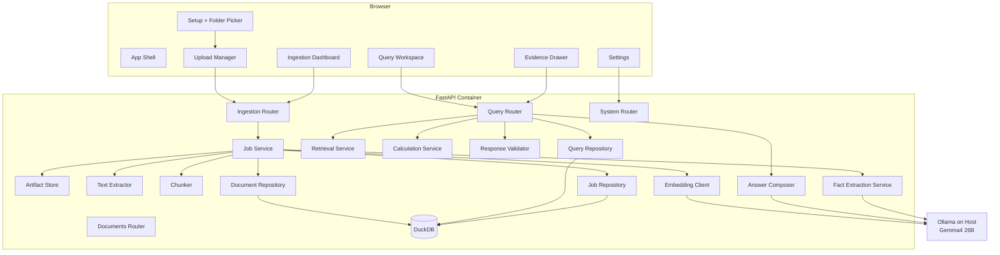
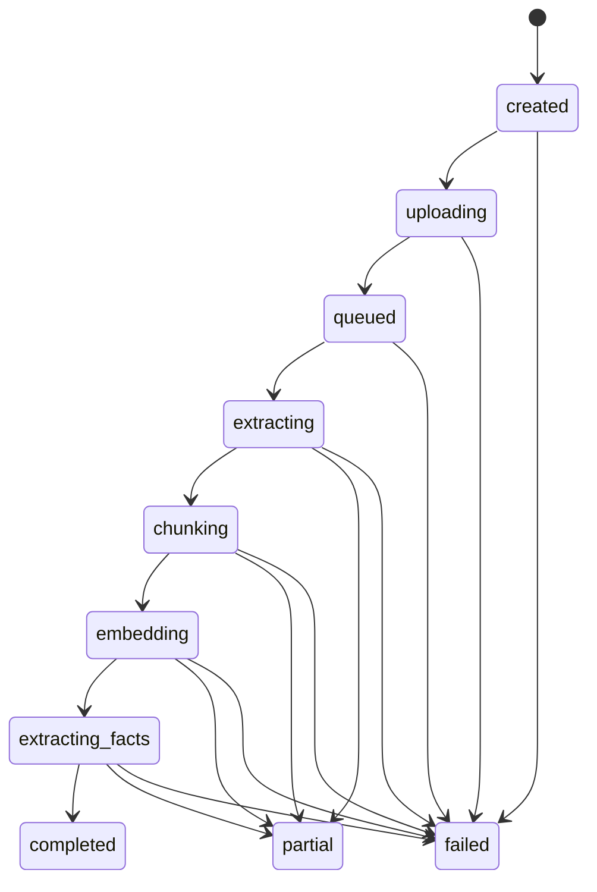
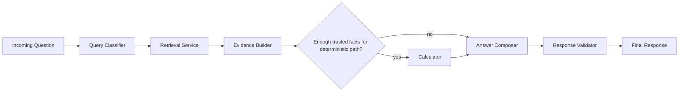
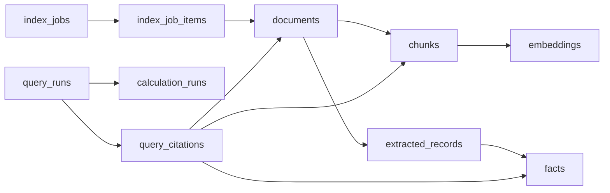

# Personal Records Intelligence Low-Level Architecture

This document translates the high-level architecture into implementation-ready modules, APIs, state transitions, and persistence design for the MVP.

If your Markdown viewer does not render Mermaid, the SVG fallback images below should still display.

## Design Goals

- keep the MVP single-user and local-first
- keep all trust-sensitive logic explicit and inspectable
- support generalized retrieval across many personal document types
- support deterministic answers only when facts are typed and provenance-backed
- make the first implementation simple enough to ship in Docker

## Runtime Topology





## Deployment Assumptions

- `frontend` runs as a React app in Docker
- `backend` runs as a FastAPI app in Docker
- `DuckDB` is a file mounted into the backend container
- `Ollama` runs on the Mac host and is accessed from Docker via `host.docker.internal`
- the browser uploads file content to the backend; the backend does not read arbitrary host file paths

## Proposed Repo / Package Layout

```text
root/
  AGENTS.md
  README.md
  docs/
  ai/
    skills/
    prompts/
  app/
    api/
      v1/
        endpoints/
          ingestion.py
          query.py
          documents.py
          system.py
        api.py
    core/
      config.py
      logging.py
      exceptions.py
    db/
      connection.py
      migrations/
    repositories/
      documents.py
      jobs.py
      queries.py
      facts.py
    schemas/
      ingestion.py
      query.py
      documents.py
      system.py
    services/
      ingestion/
        job_service.py
        manifest_service.py
        artifact_store.py
        text_extractor.py
        chunk_service.py
        embedding_service.py
      extraction/
        classifier.py
        record_extractor.py
        fact_normalizer.py
      retrieval/
        query_classifier.py
        retrieval_service.py
        ranking_service.py
        evidence_builder.py
      calculation/
        calculator_registry.py
        calculators/
          aggregate.py
          comparison.py
          date_math.py
      answer/
        prompt_builder.py
        answer_service.py
        response_validator.py
    deps.py
    main.py
  tests/
  sibling-ui-repo/
    src/
      features/
        setup/
        ingestion/
        query/
        documents/
        settings/
      lib/
```

Notes for contributors:

- `AGENTS.md` should hold project-wide standards for humans and AI assistants.
- `ai/skills/` and `ai/prompts/` are optional productivity layers and should never be required for app runtime.
- `repositories/` is preferred over `models/` for the current DuckDB-plus-SQL design.
- `api/v1` is the intended shape once the public contract stabilizes beyond the current MVP.
- the frontend remains a sibling repository, so backend docs should describe that relationship instead of implying a monorepo that does not exist today.

## Frontend Module Responsibilities

- `setup`: folder and file selection, manifest creation, upload kickoff
- `ingestion`: shows job progress, failures, file counts, re-index actions
- `query`: query box, answer card, citations, extracted facts, warnings
- `documents`: indexed document list, filter by category and status
- `settings`: model status, DuckDB stats, supported capabilities, index reset

## Browser-Side Ingestion Strategy

The MVP should support two browser acquisition paths:

- `window.showDirectoryPicker()` for Chromium-first directory selection
- `<input type="file" webkitdirectory>` as a compatibility fallback

For each selected file, the browser builds a manifest entry:

- `client_path`
- `filename`
- `mime_type`
- `size_bytes`
- `last_modified_ms`

The browser uploads files in bounded batches so the UI can show partial progress and retry individual failures.

## Backend Service Boundaries

### Ingestion Services

- `manifest_service`: validates incoming file metadata and normalizes client paths
- `artifact_store`: stores original uploaded files and generated artifacts on disk
- `text_extractor`: extracts text and provenance from PDF, DOCX, TXT, and Markdown
- `chunk_service`: splits text into retrieval-sized chunks while preserving page or span provenance
- `embedding_service`: calls Ollama embeddings and stores vectors

### Extraction Services

- `classifier`: predicts whether a document likely contains structured facts worth extracting
- `record_extractor`: uses the model to emit structured record JSON
- `fact_normalizer`: converts record JSON into typed facts with confidence and source references

### Retrieval / Query Services

- `query_classifier`: determines whether the question is retrieval-only, fact lookup, or computed
- `retrieval_service`: fetches candidate chunks and facts using semantic search plus filters
- `ranking_service`: narrows evidence to a small trusted set for final answer generation
- `evidence_builder`: builds the final evidence package used by the calculator and answer composer

### Answer Services

- `calculator_registry`: chooses a deterministic calculator based on query type and available facts
- `answer_service`: generates final wording from evidence and calculator output
- `response_validator`: rejects citation mismatches, dropped warnings, and numeric drift

## Ingestion Job State Model





### File-Level Processing Steps

1. receive file blob and manifest row
2. compute content checksum
3. upsert document record
4. persist original file to artifact store
5. extract text and provenance
6. chunk extracted text
7. request embeddings from Ollama
8. store chunks and embeddings
9. classify document for structured extraction
10. extract records if classification threshold is met
11. normalize records into typed facts
12. mark file status as `completed`, `partial`, or `failed`

## Query Execution Pipeline





### Query Types

The first implementation should classify into one of these modes:

- `semantic_search`: find relevant documents and summarize grounded evidence
- `fact_lookup`: answer directly from one or more extracted facts
- `aggregate_numeric`: totals, counts, sums, averages, grouped amounts
- `comparison`: compare numeric or date facts across documents
- `date_math`: compute ranges, notice periods, deadlines, renewal timing

### Evidence Bundle Shape

Before answer generation, the backend should build a compact evidence bundle:

- `query_run_id`
- `query_type`
- `candidate_documents[]`
- `citations[]`
- `facts[]`
- `calculator_input`
- `calculator_output`
- `warnings[]`

This bundle is the single source of truth for both answer generation and UI rendering.

## API Surface

### Ingestion Endpoints

- `POST /api/v1/ingestion/jobs`
  - creates a job and returns `job_id`
- `POST /api/v1/ingestion/jobs/{job_id}/files`
  - multipart upload for file batches plus manifest JSON
- `POST /api/v1/ingestion/jobs/{job_id}/finalize`
  - signals upload completion and starts processing
- `GET /api/v1/ingestion/jobs/{job_id}`
  - returns job summary, file counts, and per-stage status
- `GET /api/v1/ingestion/jobs/{job_id}/events`
  - SSE stream for progress updates

### Documents Endpoints

- `GET /api/v1/documents`
  - filters: `status`, `category`, `query`
- `GET /api/v1/documents/{document_id}`
  - metadata, extraction summary, and facts
- `DELETE /api/v1/documents/{document_id}`
  - removes the document, chunks, embeddings, records, and file artifact
- `POST /api/v1/documents/reindex`
  - accepts a new upload manifest and refreshes changed files

### Query Endpoints

- `POST /api/v1/query-runs`
  - accepts a question and optional retrieval parameters
- `GET /api/v1/query-runs/{query_run_id}`
  - returns final answer payload and persisted trace
- `GET /api/v1/query-runs/{query_run_id}/events`
  - optional SSE stream for long-running answers

### System Endpoints

- `GET /api/v1/system/health`
  - verifies API, DuckDB, and Ollama connectivity
- `GET /api/v1/system/capabilities`
  - returns supported file types, calculators, and model info
- `POST /api/v1/system/reset-index`
  - wipes the local index after explicit confirmation

## Response Contracts

### Query Request

```json
{
  "question": "When does this agreement renew and how much is the monthly payment?",
  "top_k": 8,
  "document_ids": [],
  "include_trace": true
}
```

### Query Response

```json
{
  "query_run_id": "qr_123",
  "status": "completed",
  "query_type": "date_math",
  "answer_mode": "computed",
  "answer_text": "The agreement renews on January 1, 2027 and the monthly payment is $250.",
  "citations": [
    {
      "document_id": "doc_1",
      "chunk_id": "chk_9",
      "fact_id": "fact_3",
      "label": "Service Agreement.pdf p.4",
      "score": 0.93
    }
  ],
  "facts": [
    {
      "fact_id": "fact_3",
      "fact_type": "monthly_payment_amount",
      "value_number": 250.0,
      "currency": "USD",
      "confidence": 0.97
    }
  ],
  "calculation_trace": {
    "calculator_type": "date_math",
    "inputs": [],
    "outputs": [],
    "warnings": []
  },
  "warnings": []
}
```

## Persistence Model

### Table Relationship Map





### Core Tables

#### `index_jobs`

- `id`
- `status`
- `created_at`
- `started_at`
- `completed_at`
- `total_files`
- `processed_files`
- `failed_files`
- `warnings_json`

#### `index_job_items`

- `id`
- `job_id`
- `client_path`
- `filename`
- `status`
- `checksum`
- `error_message`
- `document_id`

#### `documents`

- `id`
- `filename`
- `client_path`
- `stored_path`
- `mime_type`
- `size_bytes`
- `checksum`
- `last_modified_ms`
- `detected_category`
- `indexing_status`
- `created_at`
- `updated_at`

#### `chunks`

- `id`
- `document_id`
- `chunk_index`
- `text`
- `page_number`
- `char_start`
- `char_end`
- `token_count`

#### `embeddings`

- `id`
- `chunk_id`
- `embedding_model`
- `vector`
- `created_at`

#### `extracted_records`

- `id`
- `document_id`
- `record_type`
- `confidence`
- `raw_payload_json`
- `source_locator_json`
- `created_at`

#### `facts`

- `id`
- `document_id`
- `record_id`
- `fact_type`
- `value_kind`
- `value_text`
- `value_number`
- `value_date`
- `unit`
- `currency`
- `confidence`
- `source_page`
- `source_span`
- `raw_evidence`

#### `query_runs`

- `id`
- `question`
- `query_type`
- `answer_mode`
- `status`
- `answer_text`
- `confidence`
- `warnings_json`
- `created_at`

#### `calculation_runs`

- `id`
- `query_run_id`
- `calculator_type`
- `inputs_json`
- `outputs_json`
- `trace_json`
- `warnings_json`
- `created_at`

#### `query_citations`

- `id`
- `query_run_id`
- `document_id`
- `chunk_id`
- `fact_id`
- `label`
- `score`

## Artifact Store Layout

The backend should manage a local artifact directory on a mounted volume:

```text
/app/data/
  duckdb/
    app.duckdb
  files/
    <document_id>/
      original.pdf
  extracted_text/
    <document_id>.json
  extraction_payloads/
    <document_id>.json
  logs/
```

This gives the system durable local storage without introducing a separate object store.

## Prompting and Guardrails

### Structured Extraction

- extraction prompts must return strict JSON
- every extracted field must carry a source locator
- low-confidence fields remain visible but should not be eligible for deterministic calculations by default

### Answer Composition

The LLM should receive:

- the user question
- the selected citations
- the selected facts
- calculator outputs if present
- a required warning list
- an output schema for `answer_text`, `warnings`, and `citation_ids`

### Response Validation

`response_validator` should enforce:

- all cited IDs exist in the evidence bundle
- numeric values in the final answer match calculator outputs when `answer_mode = computed`
- warnings from the calculator or retrieval layer are present in the final response
- unsupported certainty falls back to qualified language rather than exact claims

## Concurrency Model

- one FastAPI process should own DuckDB writes
- ingestion work should run through a bounded internal worker queue
- query handling may run concurrently, but write-heavy operations should serialize through repository boundaries
- long-running work should stream progress to the UI over SSE

This keeps DuckDB usage simple and avoids turning MVP into a distributed system.

## Configuration

Minimum backend environment variables:

- `OLLAMA_BASE_URL=http://host.docker.internal:11434`
- `OLLAMA_CHAT_MODEL=qwen2.5:7b`
- `OLLAMA_EMBEDDING_MODEL=nomic-embed-text`
- `OLLAMA_CHAT_NUM_CTX=4096`
- `DUCKDB_PATH=/app/data/duckdb/app.duckdb`
- `ARTIFACTS_DIR=/app/data`
- `MAX_BATCH_FILES=25`
- `MAX_BATCH_BYTES=104857600`

## Failure and Fallback Rules

- if file extraction fails, mark the document failed and continue the job
- if fact extraction fails, keep the document retrievable using chunks only
- if embeddings fail for a file, leave the file in `partial` state and surface it in the UI
- if Ollama is unavailable during query time, return a degraded retrieval error rather than fabricating an answer
- if deterministic calculation is not safe, downgrade the answer to retrieval-backed explanation with explicit warnings

## Recommended MVP Build Order

1. ingestion API, artifact store, DuckDB schema, and document listing
2. text extraction, chunking, embeddings, and basic semantic retrieval
3. query workspace with citations and stored query runs
4. structured extraction and normalized facts
5. deterministic calculators and response validation
6. settings, reset-index flow, and hardening
